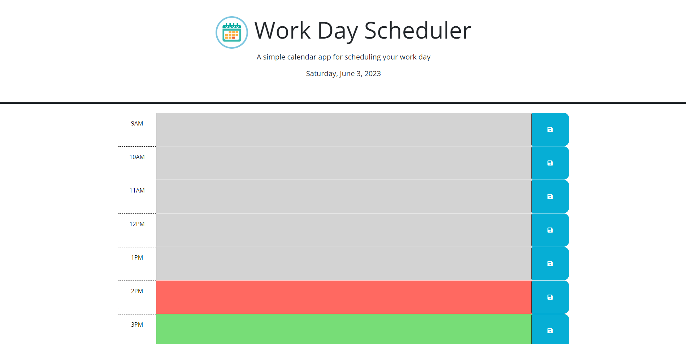

# Calenda

Calenda is a simple web application using DayJS, bootstrap, and JQuery API's to help you schedule your workdays
## Powered by
- Bootstrap
- DayJS
- JQuery

## Link
https://aetherealdev.github.io/Calenda/

## License
This code is licensed using the [MIT](LICENSE) License
